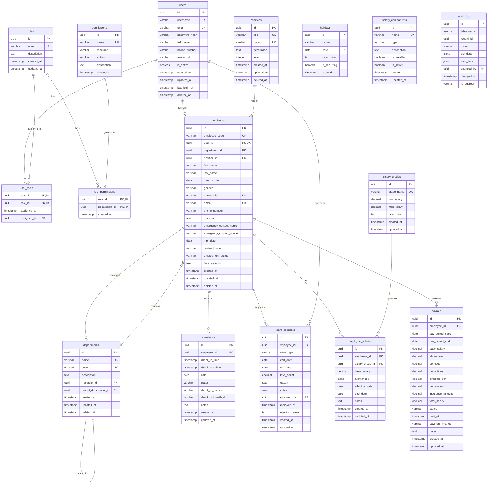

# Database Schema Documentation

## Overview

This document describes the database schema for the HR Management System (HRMS). The system uses PostgreSQL 14+ and implements Role-Based Access Control (RBAC) for secure data management.

## Entity Relationship Diagram (ERD)



## Table Descriptions

### User Management Tables

#### users
Stores user account information for authentication and authorization.

| Column | Type | Constraints | Description |
|--------|------|-------------|-------------|
| id | UUID | PRIMARY KEY, DEFAULT uuid_generate_v4() | Unique identifier |
| username | VARCHAR(100) | UNIQUE, NOT NULL | Login username |
| email | VARCHAR(255) | UNIQUE, NOT NULL | User email address |
| password_hash | VARCHAR(255) | NOT NULL | Bcrypt hashed password |
| full_name | VARCHAR(255) | | User's full name |
| phone_number | VARCHAR(20) | | Contact phone number |
| avatar_url | VARCHAR(500) | | Profile picture URL |
| is_active | BOOLEAN | DEFAULT TRUE | Account active status |
| created_at | TIMESTAMPTZ | DEFAULT CURRENT_TIMESTAMP | Record creation time |
| updated_at | TIMESTAMPTZ | DEFAULT CURRENT_TIMESTAMP | Last update time |
| last_login_at | TIMESTAMPTZ | | Last successful login |
| deleted_at | TIMESTAMPTZ | | Soft delete timestamp |

#### roles
Defines system roles for role-based access control.

| Column | Type | Constraints | Description |
|--------|------|-------------|-------------|
| id | UUID | PRIMARY KEY | Unique identifier |
| name | VARCHAR(50) | UNIQUE, NOT NULL | Role name (e.g., 'admin', 'employee') |
| description | TEXT | | Role description |
| created_at | TIMESTAMPTZ | DEFAULT CURRENT_TIMESTAMP | Record creation time |
| updated_at | TIMESTAMPTZ | DEFAULT CURRENT_TIMESTAMP | Last update time |

#### permissions
Defines granular permissions for resource access.

| Column | Type | Constraints | Description |
|--------|------|-------------|-------------|
| id | UUID | PRIMARY KEY | Unique identifier |
| name | VARCHAR(100) | UNIQUE, NOT NULL | Permission name |
| resource | VARCHAR(50) | NOT NULL | Target resource (e.g., 'employees') |
| action | VARCHAR(20) | NOT NULL, CHECK | Action type: create, read, update, delete, manage |
| description | TEXT | | Permission description |
| created_at | TIMESTAMPTZ | DEFAULT CURRENT_TIMESTAMP | Record creation time |

#### user_roles
Junction table mapping users to their assigned roles.

| Column | Type | Constraints | Description |
|--------|------|-------------|-------------|
| user_id | UUID | PRIMARY KEY, FOREIGN KEY | Reference to users.id |
| role_id | UUID | PRIMARY KEY, FOREIGN KEY | Reference to roles.id |
| assigned_at | TIMESTAMPTZ | DEFAULT CURRENT_TIMESTAMP | When role was assigned |
| assigned_by | UUID | FOREIGN KEY | User who assigned the role |

#### role_permissions
Junction table mapping roles to their granted permissions.

| Column | Type | Constraints | Description |
|--------|------|-------------|-------------|
| role_id | UUID | PRIMARY KEY, FOREIGN KEY | Reference to roles.id |
| permission_id | UUID | PRIMARY KEY, FOREIGN KEY | Reference to permissions.id |
| created_at | TIMESTAMPTZ | DEFAULT CURRENT_TIMESTAMP | When permission was granted |

### HR Management Tables

#### departments
Stores organizational department information with hierarchical support.

| Column | Type | Constraints | Description |
|--------|------|-------------|-------------|
| id | UUID | PRIMARY KEY | Unique identifier |
| name | VARCHAR(100) | UNIQUE, NOT NULL | Department name |
| code | VARCHAR(20) | UNIQUE, NOT NULL | Short department code |
| description | TEXT | | Department description |
| manager_id | UUID | FOREIGN KEY | Reference to department manager (employees.id) |
| parent_department_id | UUID | FOREIGN KEY (self) | Parent department for hierarchy |
| created_at | TIMESTAMPTZ | DEFAULT CURRENT_TIMESTAMP | Record creation time |
| updated_at | TIMESTAMPTZ | DEFAULT CURRENT_TIMESTAMP | Last update time |
| deleted_at | TIMESTAMPTZ | | Soft delete timestamp |

#### positions
Stores job positions/titles with level hierarchy.

| Column | Type | Constraints | Description |
|--------|------|-------------|-------------|
| id | UUID | PRIMARY KEY | Unique identifier |
| title | VARCHAR(100) | UNIQUE, NOT NULL | Position title |
| code | VARCHAR(20) | UNIQUE, NOT NULL | Short position code |
| description | TEXT | | Position description |
| level | INTEGER | DEFAULT 1, CHECK (1-20) | Hierarchy level |
| created_at | TIMESTAMPTZ | DEFAULT CURRENT_TIMESTAMP | Record creation time |
| updated_at | TIMESTAMPTZ | DEFAULT CURRENT_TIMESTAMP | Last update time |
| deleted_at | TIMESTAMPTZ | | Soft delete timestamp |

#### employees
Stores employee personal and professional information.

| Column | Type | Constraints | Description |
|--------|------|-------------|-------------|
| id | UUID | PRIMARY KEY | Unique identifier |
| employee_code | VARCHAR(20) | UNIQUE, NOT NULL | Employee ID code |
| user_id | UUID | UNIQUE, FOREIGN KEY | Link to user account |
| department_id | UUID | FOREIGN KEY | Reference to departments.id |
| position_id | UUID | FOREIGN KEY | Reference to positions.id |
| first_name | VARCHAR(100) | NOT NULL | First name |
| last_name | VARCHAR(100) | NOT NULL | Last name |
| date_of_birth | DATE | | Birth date |
| gender | VARCHAR(10) | CHECK | male, female, other |
| national_id | VARCHAR(20) | UNIQUE | National ID number |
| email | VARCHAR(255) | UNIQUE, NOT NULL | Work email |
| phone_number | VARCHAR(20) | | Contact phone |
| address | TEXT | | Home address |
| emergency_contact_name | VARCHAR(255) | | Emergency contact name |
| emergency_contact_phone | VARCHAR(20) | | Emergency contact phone |
| hire_date | DATE | NOT NULL | Employment start date |
| contract_type | VARCHAR(50) | CHECK | full_time, part_time, contract, intern, probation |
| employment_status | VARCHAR(20) | DEFAULT 'active', CHECK | active, on_leave, terminated, suspended |
| face_encoding | TEXT | | Face recognition data |
| created_at | TIMESTAMPTZ | DEFAULT CURRENT_TIMESTAMP | Record creation time |
| updated_at | TIMESTAMPTZ | DEFAULT CURRENT_TIMESTAMP | Last update time |
| deleted_at | TIMESTAMPTZ | | Soft delete timestamp |

### Attendance Tables

#### attendance
Stores daily attendance records for employees.

| Column | Type | Constraints | Description |
|--------|------|-------------|-------------|
| id | UUID | PRIMARY KEY | Unique identifier |
| employee_id | UUID | NOT NULL, FOREIGN KEY | Reference to employees.id |
| check_in_time | TIMESTAMPTZ | | Check-in timestamp |
| check_out_time | TIMESTAMPTZ | | Check-out timestamp |
| date | DATE | NOT NULL | Attendance date |
| status | VARCHAR(20) | DEFAULT 'present', CHECK | present, late, absent, on_leave, holiday, half_day |
| check_in_method | VARCHAR(30) | CHECK | face_recognition, manual, card, mobile, biometric |
| check_out_method | VARCHAR(30) | CHECK | Same as check_in_method |
| notes | TEXT | | Additional notes |
| created_at | TIMESTAMPTZ | DEFAULT CURRENT_TIMESTAMP | Record creation time |
| updated_at | TIMESTAMPTZ | DEFAULT CURRENT_TIMESTAMP | Last update time |

**Unique Constraint:** (employee_id, date)

#### leave_requests
Stores employee leave/absence requests.

| Column | Type | Constraints | Description |
|--------|------|-------------|-------------|
| id | UUID | PRIMARY KEY | Unique identifier |
| employee_id | UUID | NOT NULL, FOREIGN KEY | Reference to employees.id |
| leave_type | VARCHAR(30) | NOT NULL, CHECK | annual, sick, unpaid, maternity, paternity, bereavement, personal, other |
| start_date | DATE | NOT NULL | Leave start date |
| end_date | DATE | NOT NULL | Leave end date |
| days_count | DECIMAL(5,2) | | Number of leave days |
| reason | TEXT | | Leave reason |
| status | VARCHAR(20) | DEFAULT 'pending', CHECK | pending, approved, rejected, cancelled |
| approved_by | UUID | FOREIGN KEY | Reference to users.id |
| approved_at | TIMESTAMPTZ | | Approval timestamp |
| rejection_reason | TEXT | | Reason for rejection |
| created_at | TIMESTAMPTZ | DEFAULT CURRENT_TIMESTAMP | Record creation time |
| updated_at | TIMESTAMPTZ | DEFAULT CURRENT_TIMESTAMP | Last update time |

#### holidays
Stores company-wide holidays.

| Column | Type | Constraints | Description |
|--------|------|-------------|-------------|
| id | UUID | PRIMARY KEY | Unique identifier |
| name | VARCHAR(100) | NOT NULL | Holiday name |
| date | DATE | NOT NULL, UNIQUE | Holiday date |
| description | TEXT | | Holiday description |
| is_recurring | BOOLEAN | DEFAULT FALSE | Annual recurring flag |
| created_at | TIMESTAMPTZ | DEFAULT CURRENT_TIMESTAMP | Record creation time |

### Salary Tables

#### salary_grades
Defines salary grades/bands for the organization.

| Column | Type | Constraints | Description |
|--------|------|-------------|-------------|
| id | UUID | PRIMARY KEY | Unique identifier |
| grade_name | VARCHAR(50) | UNIQUE, NOT NULL | Grade name |
| min_salary | DECIMAL(15,2) | NOT NULL | Minimum salary |
| max_salary | DECIMAL(15,2) | NOT NULL | Maximum salary |
| description | TEXT | | Grade description |
| created_at | TIMESTAMPTZ | DEFAULT CURRENT_TIMESTAMP | Record creation time |
| updated_at | TIMESTAMPTZ | DEFAULT CURRENT_TIMESTAMP | Last update time |

#### employee_salaries
Stores employee salary history and current salary.

| Column | Type | Constraints | Description |
|--------|------|-------------|-------------|
| id | UUID | PRIMARY KEY | Unique identifier |
| employee_id | UUID | NOT NULL, FOREIGN KEY | Reference to employees.id |
| salary_grade_id | UUID | FOREIGN KEY | Reference to salary_grades.id |
| base_salary | DECIMAL(15,2) | NOT NULL | Base salary amount |
| allowances | JSONB | DEFAULT '{}' | Allowances as JSON |
| effective_date | DATE | NOT NULL | When salary becomes effective |
| end_date | DATE | | When salary ends (null for current) |
| notes | TEXT | | Additional notes |
| created_at | TIMESTAMPTZ | DEFAULT CURRENT_TIMESTAMP | Record creation time |
| updated_at | TIMESTAMPTZ | DEFAULT CURRENT_TIMESTAMP | Last update time |

#### payrolls
Stores monthly payroll records.

| Column | Type | Constraints | Description |
|--------|------|-------------|-------------|
| id | UUID | PRIMARY KEY | Unique identifier |
| employee_id | UUID | NOT NULL, FOREIGN KEY | Reference to employees.id |
| pay_period_start | DATE | NOT NULL | Pay period start date |
| pay_period_end | DATE | NOT NULL | Pay period end date |
| base_salary | DECIMAL(15,2) | DEFAULT 0 | Base salary |
| allowances | DECIMAL(15,2) | DEFAULT 0 | Total allowances |
| bonuses | DECIMAL(15,2) | DEFAULT 0 | Total bonuses |
| deductions | DECIMAL(15,2) | DEFAULT 0 | Total deductions |
| overtime_pay | DECIMAL(15,2) | DEFAULT 0 | Overtime payment |
| tax_amount | DECIMAL(15,2) | DEFAULT 0 | Tax deduction |
| insurance_amount | DECIMAL(15,2) | DEFAULT 0 | Insurance deduction |
| total_salary | DECIMAL(15,2) | DEFAULT 0 | Net salary |
| status | VARCHAR(20) | DEFAULT 'draft', CHECK | draft, pending, approved, paid, cancelled |
| paid_at | TIMESTAMPTZ | | Payment timestamp |
| payment_method | VARCHAR(30) | CHECK | bank_transfer, cash, check, digital_wallet |
| notes | TEXT | | Additional notes |
| created_at | TIMESTAMPTZ | DEFAULT CURRENT_TIMESTAMP | Record creation time |
| updated_at | TIMESTAMPTZ | DEFAULT CURRENT_TIMESTAMP | Last update time |

**Unique Constraint:** (employee_id, pay_period_start, pay_period_end)

#### salary_components
Defines types of salary components (allowances, deductions, bonuses).

| Column | Type | Constraints | Description |
|--------|------|-------------|-------------|
| id | UUID | PRIMARY KEY | Unique identifier |
| name | VARCHAR(100) | UNIQUE, NOT NULL | Component name |
| type | VARCHAR(20) | NOT NULL, CHECK | allowance, deduction, bonus |
| description | TEXT | | Component description |
| is_taxable | BOOLEAN | DEFAULT TRUE | Whether component is taxable |
| is_active | BOOLEAN | DEFAULT TRUE | Whether component is active |
| created_at | TIMESTAMPTZ | DEFAULT CURRENT_TIMESTAMP | Record creation time |
| updated_at | TIMESTAMPTZ | DEFAULT CURRENT_TIMESTAMP | Last update time |

### Audit Table

#### audit_log
Stores audit trail for data changes.

| Column | Type | Constraints | Description |
|--------|------|-------------|-------------|
| id | UUID | PRIMARY KEY | Unique identifier |
| table_name | VARCHAR(100) | NOT NULL | Table that was modified |
| record_id | UUID | NOT NULL | ID of modified record |
| action | VARCHAR(20) | NOT NULL, CHECK | INSERT, UPDATE, DELETE |
| old_data | JSONB | | Previous record state |
| new_data | JSONB | | New record state |
| changed_by | UUID | FOREIGN KEY | User who made the change |
| changed_at | TIMESTAMPTZ | DEFAULT CURRENT_TIMESTAMP | When change occurred |
| ip_address | VARCHAR(45) | | Client IP address |

## Indexes

The following indexes are created for performance optimization:

### Users Table
- `idx_users_email` - Email lookup
- `idx_users_username` - Username lookup
- `idx_users_is_active` - Partial index for active users
- `idx_users_deleted_at` - Partial index for non-deleted users

### Employees Table
- `idx_employees_code` - Employee code lookup
- `idx_employees_email` - Email lookup
- `idx_employees_department` - Department filtering
- `idx_employees_position` - Position filtering
- `idx_employees_status` - Status filtering
- `idx_employees_active` - Partial index for active employees
- `idx_employees_name` - Name search

### Attendance Table
- `idx_attendance_employee_date` - Employee + date composite
- `idx_attendance_date` - Date filtering
- `idx_attendance_status` - Status filtering

### Leave Requests Table
- `idx_leave_requests_employee` - Employee filtering
- `idx_leave_requests_status` - Status filtering
- `idx_leave_requests_dates` - Date range queries
- `idx_leave_requests_pending` - Partial index for pending requests

### Payrolls Table
- `idx_payrolls_employee` - Employee filtering
- `idx_payrolls_period` - Pay period filtering
- `idx_payrolls_status` - Status filtering
- `idx_payrolls_pending` - Partial index for pending payrolls

## Database Functions

### Utility Functions

| Function | Description |
|----------|-------------|
| `update_updated_at_column()` | Automatically updates `updated_at` timestamp |
| `generate_employee_code()` | Generates unique employee codes (EMP{YEAR}{SEQUENCE}) |

### Validation Functions

| Function | Description |
|----------|-------------|
| `prevent_duplicate_users()` | Prevents duplicate email/username |
| `prevent_duplicate_employees()` | Prevents duplicate employee_code/national_id/email |
| `validate_attendance()` | Validates attendance records |
| `validate_leave_request()` | Validates leave requests and checks for overlaps |
| `validate_payroll_period()` | Validates payroll periods |

### Helper Functions

| Function | Description |
|----------|-------------|
| `get_user_permissions(user_id)` | Returns all permissions for a user |
| `check_user_permission(user_id, resource, action)` | Checks if user has specific permission |
| `get_employee_current_salary(employee_id)` | Returns current salary for employee |
| `get_department_employees_count(department_id)` | Returns count of active employees |

### Cleanup Functions

| Function | Description |
|----------|-------------|
| `cleanup_duplicate_attendance()` | Removes duplicate attendance records |
| `cleanup_orphaned_user_roles()` | Removes orphaned user_roles records |

## Triggers

### Updated At Triggers
All main tables have triggers to automatically update `updated_at`:
- `trigger_users_updated_at`
- `trigger_roles_updated_at`
- `trigger_departments_updated_at`
- `trigger_positions_updated_at`
- `trigger_employees_updated_at`
- `trigger_attendance_updated_at`
- `trigger_leave_requests_updated_at`
- `trigger_salary_grades_updated_at`
- `trigger_employee_salaries_updated_at`
- `trigger_payrolls_updated_at`
- `trigger_salary_components_updated_at`

### Validation Triggers
- `trigger_prevent_duplicate_users` - Prevents duplicate users
- `trigger_prevent_duplicate_employees` - Prevents duplicate employees
- `trigger_validate_attendance` - Validates attendance records
- `trigger_validate_leave_request` - Validates leave requests
- `trigger_validate_payroll_period` - Validates payroll periods

### Audit Triggers
- `trigger_audit_employees` - Logs employee changes
- `trigger_audit_payrolls` - Logs payroll changes
- `trigger_audit_user_roles` - Logs role assignment changes

## Common Queries

### Get User with Roles and Permissions

```sql
SELECT u.id, u.username, u.email,
       r.name as role_name,
       p.name as permission_name, p.resource, p.action
FROM users u
JOIN user_roles ur ON u.id = ur.user_id
JOIN roles r ON ur.role_id = r.id
JOIN role_permissions rp ON r.id = rp.role_id
JOIN permissions p ON rp.permission_id = p.id
WHERE u.id = $1;
```

### Get Employees with Department and Position

```sql
SELECT e.*, 
       d.name as department_name,
       p.title as position_title
FROM employees e
LEFT JOIN departments d ON e.department_id = d.id
LEFT JOIN positions p ON e.position_id = p.id
WHERE e.deleted_at IS NULL
  AND e.employment_status = 'active'
ORDER BY e.created_at DESC;
```

### Get Monthly Attendance Summary

```sql
SELECT 
    e.employee_code,
    e.first_name || ' ' || e.last_name as full_name,
    COUNT(CASE WHEN a.status = 'present' THEN 1 END) as present_days,
    COUNT(CASE WHEN a.status = 'late' THEN 1 END) as late_days,
    COUNT(CASE WHEN a.status = 'absent' THEN 1 END) as absent_days,
    COUNT(CASE WHEN a.status = 'on_leave' THEN 1 END) as leave_days
FROM employees e
LEFT JOIN attendance a ON e.id = a.employee_id
    AND a.date >= $1 AND a.date <= $2
WHERE e.deleted_at IS NULL
GROUP BY e.id, e.employee_code, e.first_name, e.last_name
ORDER BY e.employee_code;
```

### Get Pending Leave Requests for Approval

```sql
SELECT lr.*, 
       e.employee_code,
       e.first_name || ' ' || e.last_name as employee_name,
       d.name as department_name
FROM leave_requests lr
JOIN employees e ON lr.employee_id = e.id
LEFT JOIN departments d ON e.department_id = d.id
WHERE lr.status = 'pending'
ORDER BY lr.created_at ASC;
```

### Get Employee Salary History

```sql
SELECT es.*, 
       sg.grade_name,
       sg.min_salary as grade_min,
       sg.max_salary as grade_max
FROM employee_salaries es
LEFT JOIN salary_grades sg ON es.salary_grade_id = sg.id
WHERE es.employee_id = $1
ORDER BY es.effective_date DESC;
```

## Performance Recommendations

1. **Use Indexes**: The schema includes optimized indexes. Add more as query patterns evolve.

2. **Pagination**: Always use LIMIT and OFFSET for large result sets.

3. **Partial Indexes**: Use partial indexes for frequently filtered data (e.g., active employees only).

4. **Connection Pooling**: Use the provided connection pool to manage database connections efficiently.

5. **Query Optimization**: Use EXPLAIN ANALYZE to identify slow queries and optimize accordingly.

6. **Partitioning**: Consider partitioning large tables like `attendance` and `audit_log` by date for improved performance.

7. **Archiving**: Regularly archive old data from `attendance` and `audit_log` tables.

## Migration Rollback

Each migration file includes a rollback section at the bottom. To rollback, run the rollback SQL in reverse order:

1. Rollback 009 (seed data) first
2. Then 008 (functions and triggers)
3. Continue in reverse order to 001

Example rollback for migration 009:
```sql
DELETE FROM holidays WHERE id LIKE '60000000%';
DELETE FROM salary_components WHERE id LIKE '50000000%';
DELETE FROM salary_grades WHERE id LIKE '40000000%';
DELETE FROM positions WHERE id LIKE '30000000%';
DELETE FROM departments WHERE id LIKE '20000000%';
DELETE FROM user_roles WHERE user_id = '00000000-0000-0000-0000-000000000001';
DELETE FROM users WHERE id = '00000000-0000-0000-0000-000000000001';
DELETE FROM role_permissions;
DELETE FROM permissions WHERE id LIKE '10000000%';
DELETE FROM roles WHERE id IN (...);
```
