# 🔄 HR MANAGEMENT SYSTEM - FLOW DIAGRAM

## 📊 SYSTEM ARCHITECTURE OVERVIEW

```
┌─────────────────┐    ┌─────────────────┐    ┌─────────────────┐
│   FRONTEND      │    │    BACKEND      │    │   DATABASE      │
│   (React)       │◄──►│   (Flask API)   │◄──►│   (SQLite)      │
│   Port: 5173    │    │   Port: 5000    │    │   hr_system.db  │
└─────────────────┘    └─────────────────┘    └─────────────────┘
         │                       │                       │
         │                       │                       │
         ▼                       ▼                       ▼
┌─────────────────┐    ┌─────────────────┐    ┌─────────────────┐
│   FACE RECOG    │    │   FILE STORAGE  │    │   AUDIT LOGS    │
│   (OpenCV)      │    │   (Uploads)     │    │   (System Logs) │
│   Camera Input  │    │   Images/Docs   │    │   User Actions  │
└─────────────────┘    └─────────────────┘    └─────────────────┘
```

---

## 🔐 AUTHENTICATION FLOW

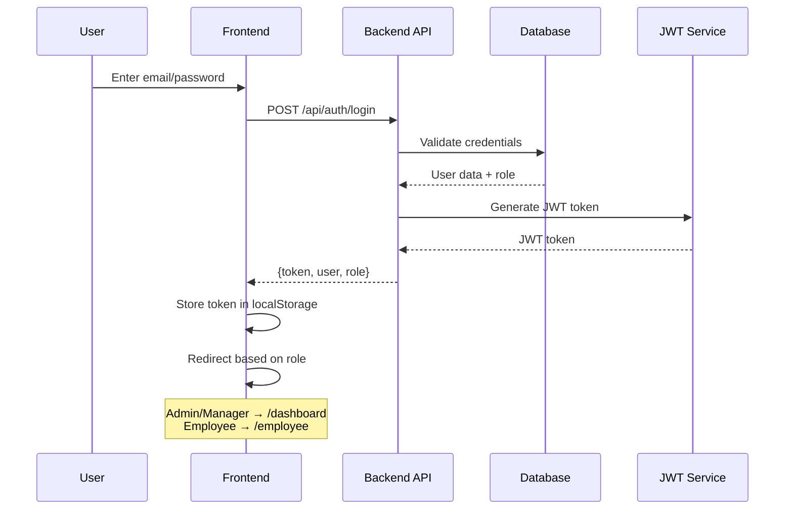

---

## 👥 EMPLOYEE MANAGEMENT FLOW

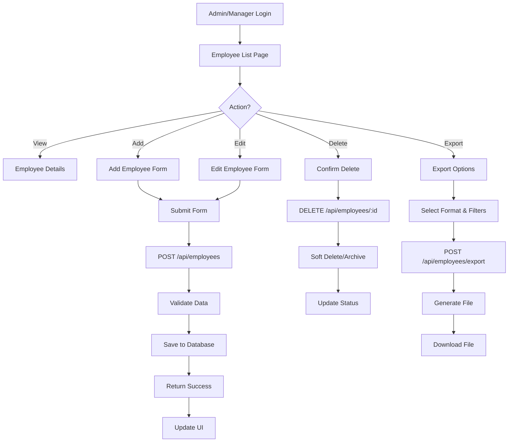

---

## ⏰ ATTENDANCE MANAGEMENT FLOW

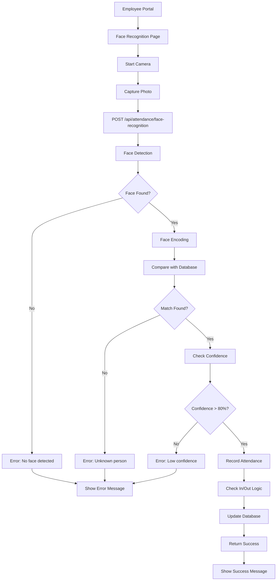

---

## 💰 PAYROLL CALCULATION FLOW

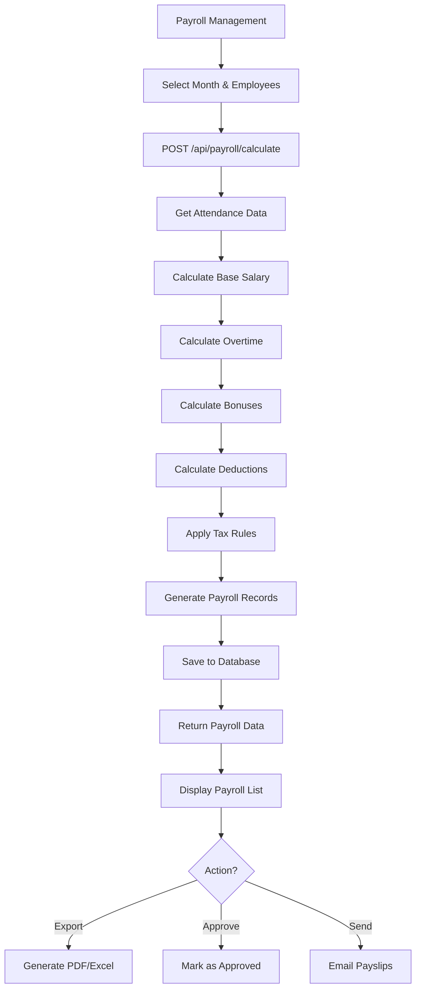

---

## 📅 LEAVE REQUEST FLOW

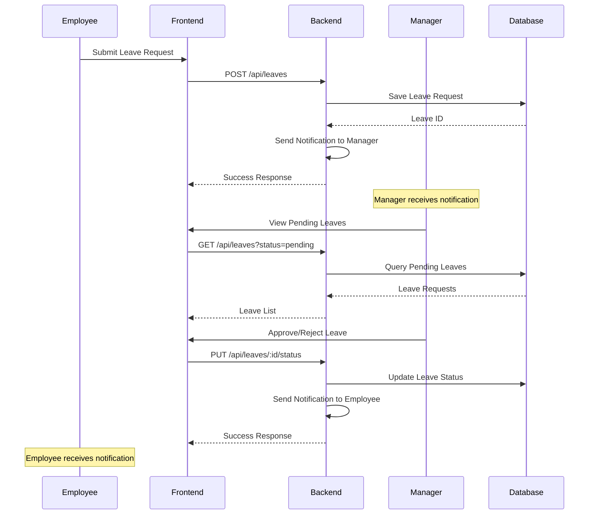

---

## 🔍 AUDIT LOG FLOW

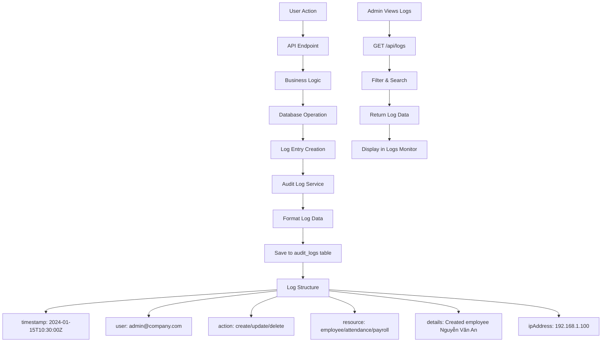

---

## 📊 DASHBOARD DATA FLOW

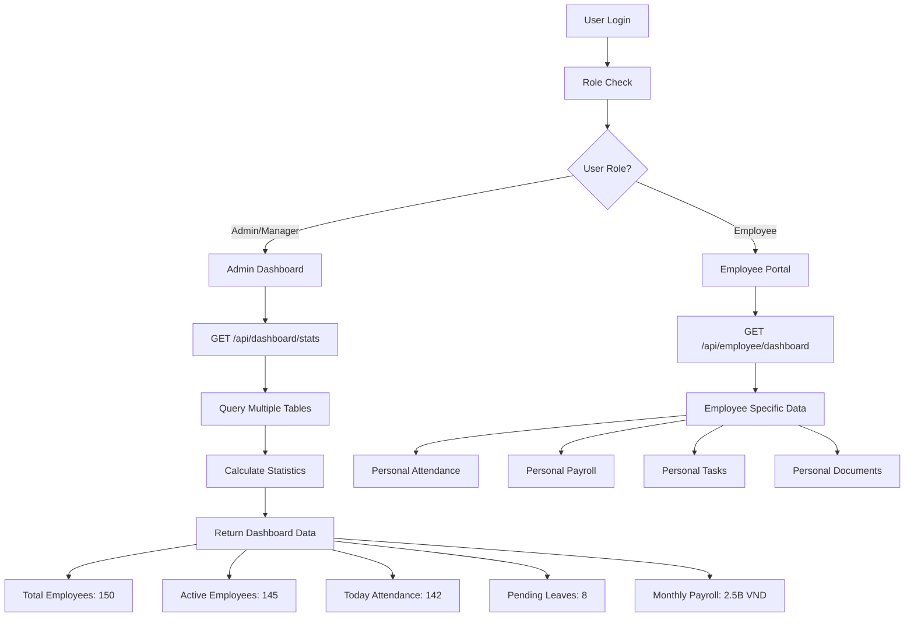

---

## 🔄 REAL-TIME FACE RECOGNITION FLOW

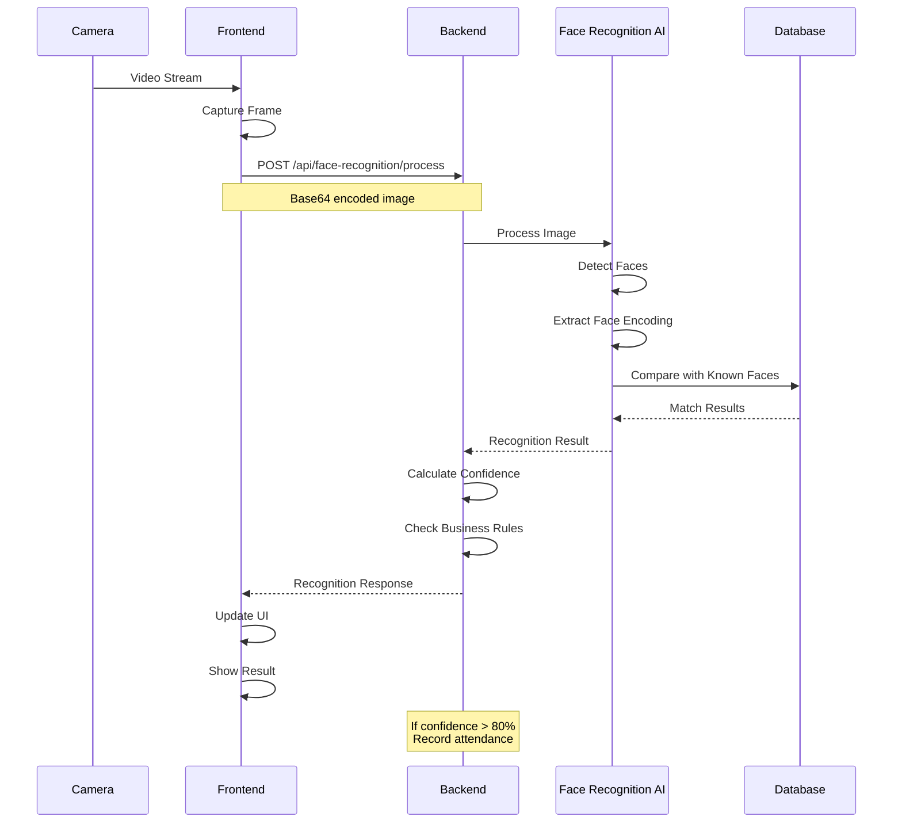

---

## 📋 API REQUEST/RESPONSE FLOW

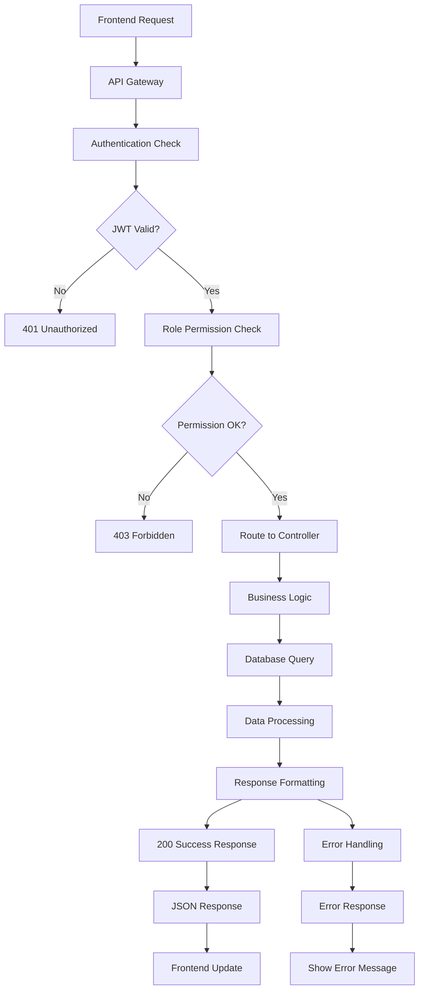

---

## 🗄️ DATABASE RELATIONSHIPS

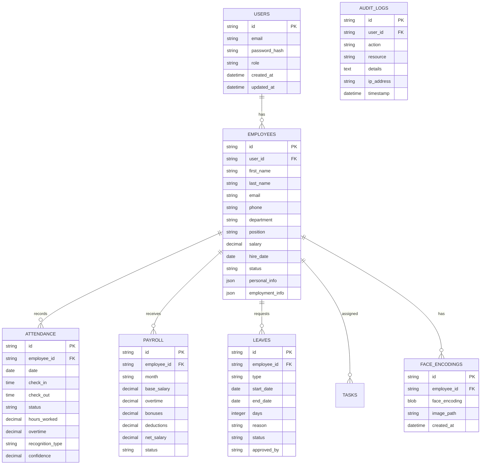

---

## 🚀 DEPLOYMENT FLOW

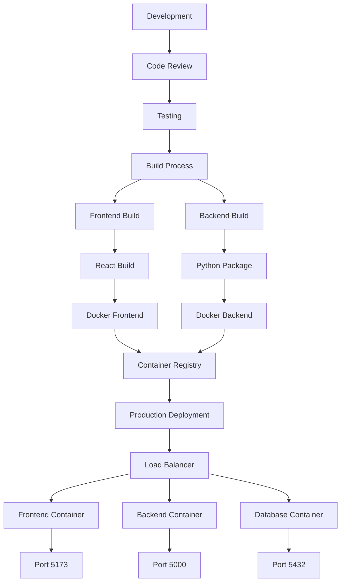

---

## 📱 USER JOURNEY FLOWS

### Admin Journey:
```
Login → Dashboard → Employee Management → Add Employee → Face Registration → Attendance Monitoring → Payroll Generation → Reports
```

### Manager Journey:
```
Login → Dashboard → Employee List → Attendance Management → Leave Approvals → Payroll Review → Reports
```

### Employee Journey:
```
Login → Employee Portal → Face Recognition Check-in → View Attendance → Request Leave → View Payroll → Personal Documents
```

---

## 🔧 ERROR HANDLING FLOW

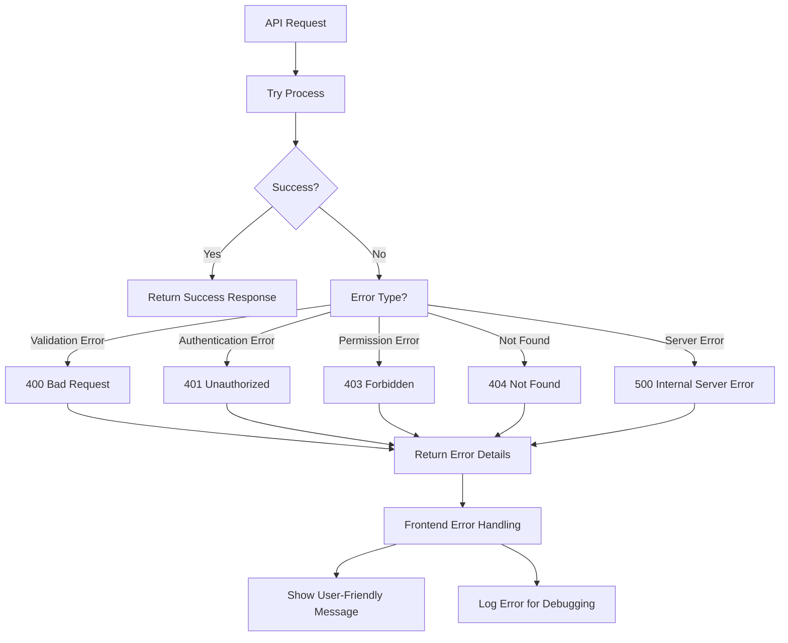

---

## 📊 MONITORING & LOGGING FLOW

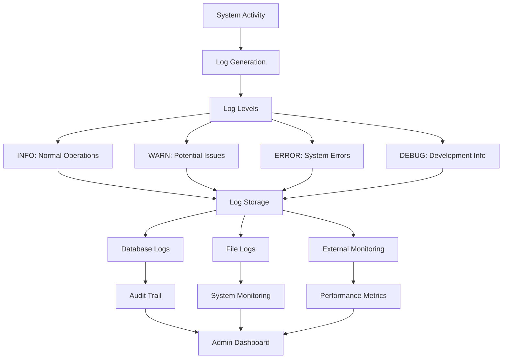

---

## 🎯 KEY INTEGRATION POINTS

### 1. **Face Recognition Integration**
- Camera input → Image processing → Face encoding → Database comparison → Attendance recording

### 2. **Role-Based Access Control**
- JWT token → Role validation → Permission check → API access

### 3. **Real-time Notifications**
- System events → Notification service → WebSocket → Frontend updates

### 4. **File Upload/Export**
- File selection → Upload to storage → Database reference → Download/Export

### 5. **Audit Trail**
- User actions → Log service → Database storage → Admin monitoring

---

## 📋 BACKEND IMPLEMENTATION PRIORITIES

### Phase 1 (Core Features):
1. **Authentication & Authorization**
2. **Employee CRUD Operations**
3. **Basic Attendance Management**
4. **Database Setup & Models**

### Phase 2 (Advanced Features):
1. **Face Recognition Integration**
2. **Payroll Calculation**
3. **Leave Management**
4. **Audit Logging**

### Phase 3 (Enhancement):
1. **Real-time Notifications**
2. **Advanced Reports**
3. **File Management**
4. **Performance Optimization**

---

## 🔗 API ENDPOINT SUMMARY

| Module | Endpoint | Method | Description |
|--------|----------|--------|-------------|
| Auth | `/api/auth/login` | POST | User authentication |
| Auth | `/api/auth/logout` | POST | User logout |
| Employees | `/api/employees` | GET | List employees |
| Employees | `/api/employees` | POST | Create employee |
| Employees | `/api/employees/:id` | PUT | Update employee |
| Employees | `/api/employees/:id` | DELETE | Delete employee |
| Attendance | `/api/attendance` | GET | Get attendance records |
| Attendance | `/api/attendance/face-recognition` | POST | Face recognition check-in |
| Payroll | `/api/payroll` | GET | Get payroll records |
| Payroll | `/api/payroll/calculate` | POST | Calculate payroll |
| Leaves | `/api/leaves` | GET | Get leave requests |
| Leaves | `/api/leaves` | POST | Create leave request |
| Dashboard | `/api/dashboard/stats` | GET | Get dashboard statistics |
| Logs | `/api/logs` | GET | Get audit logs |

---

**Backend team có thể sử dụng flow diagram này để hiểu rõ cách hệ thống hoạt động và implement API theo đúng logic!** 🚀
Hệ thống gồm 3 phần chính:

Thành phần	Công nghệ	Vai trò
Frontend	React (Port 5173)	Giao diện người dùng (nhân viên, quản lý, admin)
Backend API	Flask (Port 5000)	Xử lý logic nghiệp vụ, xác thực, tính toán, lưu trữ dữ liệu
Database	SQLite (hr_system.db)	Lưu dữ liệu nhân sự, chấm công, lương, đơn nghỉ, nhật ký hệ thống

Ngoài ra còn có các thành phần phụ:

Face Recognition (OpenCV) → dùng camera nhận diện khuôn mặt khi chấm công.

File Storage → lưu ảnh, tài liệu nhân viên.

Audit Logs → ghi lại hành động người dùng (ai tạo, sửa, xóa dữ liệu).

🔐 2️⃣ Quy trình xác thực đăng nhập (Authentication Flow)

Người dùng nhập email và mật khẩu trên giao diện (Frontend).

Gửi yêu cầu POST /api/auth/login đến Backend.

Backend kiểm tra tài khoản trong Database.

Nếu hợp lệ → Backend tạo JWT token và gửi lại cho Frontend.

Frontend lưu token vào localStorage và điều hướng theo vai trò:

Admin / Manager → /dashboard

Employee → /employee

Token này sẽ được dùng cho mọi API khác để xác định quyền truy cập.

👥 3️⃣ Quy trình quản lý nhân viên (Employee Management Flow)

Quản lý hoặc admin đăng nhập → vào trang danh sách nhân viên.

Có thể:

Xem chi tiết nhân viên.

Thêm mới nhân viên → gửi POST /api/employees.

Chỉnh sửa → cập nhật thông tin.

Xóa (Soft Delete) → đổi trạng thái “đã nghỉ”.

Xuất dữ liệu → PDF / Excel qua /api/employees/export.

Mọi thao tác đều được lưu vào CSDL và cập nhật lại UI.

⏰ 4️⃣ Quy trình chấm công bằng khuôn mặt (Attendance Management Flow)

Nhân viên mở cổng nhân viên → bật camera.

Hệ thống chụp ảnh, gửi đến /api/attendance/face-recognition.

AI xử lý ảnh → trích xuất mã nhận dạng khuôn mặt (face encoding).

So sánh với dữ liệu trong DB:

Nếu không khớp → báo “Không nhận diện được”.

Nếu khớp và độ chính xác > 80% → ghi công vào DB.

Hệ thống xác định là check-in hay check-out tùy thời điểm.

Trả về kết quả và hiển thị thông báo cho người dùng.

💰 5️⃣ Quy trình tính lương (Payroll Flow)

Quản lý chọn tháng và nhân viên cần tính lương.

Gửi yêu cầu POST /api/payroll/calculate.

Backend:

Lấy dữ liệu chấm công → tính lương cơ bản, làm thêm, thưởng, khấu trừ.

Áp dụng quy tắc thuế TNCN → tính lương thực nhận.

Lưu kết quả vào bảng PAYROLL.

Có thể xuất PDF / Excel hoặc gửi phiếu lương qua email.

📅 6️⃣ Quy trình xin nghỉ phép (Leave Request Flow)

Nhân viên gửi đơn nghỉ qua /api/leaves.

Backend lưu đơn và gửi thông báo cho Manager.

Manager xem danh sách đơn “pending” → có thể duyệt hoặc từ chối.

Backend cập nhật trạng thái đơn và thông báo lại cho nhân viên.

🔍 7️⃣ Ghi nhật ký hệ thống (Audit Log Flow)

Mọi hành động (tạo, sửa, xóa, đăng nhập, v.v.) sẽ:

Gửi qua Audit Log Service.

Ghi lại vào bảng AUDIT_LOGS với các thông tin:

timestamp – thời gian

user – người thực hiện

action – hành động

resource – loại tài nguyên (nhân viên, chấm công, lương, …)

details – mô tả chi tiết

ipAddress – địa chỉ IP

Admin có thể xem lại qua /api/logs.

📊 8️⃣ Dashboard (Trang tổng quan)

Khi người dùng đăng nhập, hệ thống kiểm tra role:

Admin/Manager → hiển thị số liệu tổng hợp (nhân viên, lương, nghỉ phép).

Employee → hiển thị dữ liệu cá nhân (chấm công, lương, hồ sơ).

API /api/dashboard/stats tổng hợp nhiều bảng để trả dữ liệu thống kê.

🧠 9️⃣ Nhận diện khuôn mặt theo thời gian thực (Real-time Recognition)

Camera gửi luồng video / ảnh base64 đến Backend.

AI xử lý: phát hiện khuôn mặt → mã hóa → so sánh → trả về độ chính xác.

Nếu vượt ngưỡng (80%) → tự động ghi công vào bảng ATTENDANCE.

🗄️ 🔢 10️⃣ Cấu trúc cơ sở dữ liệu

Bao gồm các bảng:

USERS – người dùng (đăng nhập)

EMPLOYEES – thông tin nhân viên

ATTENDANCE – dữ liệu chấm công

PAYROLL – lương

LEAVES – đơn nghỉ phép

FACE_ENCODINGS – dữ liệu khuôn mặt

AUDIT_LOGS – nhật ký hệ thống

→ Các bảng được liên kết theo employee_id, user_id (quan hệ 1-nhiều).

🚀 11️⃣ Quy trình triển khai (Deployment Flow)

Code được phát triển → review → test → build.

Frontend build React → Docker container (port 5173).

Backend build Flask → Docker container (port 5000).

Database (Postgres hoặc SQLite) container (port 5432).

Triển khai lên môi trường Production qua Load Balancer.

👣 12️⃣ Hành trình người dùng (User Journey)
Vai trò	Quy trình chính
Admin	Đăng nhập → Quản lý nhân viên → Đăng ký khuôn mặt → Theo dõi chấm công → Tạo lương → Báo cáo
Manager	Đăng nhập → Duyệt nghỉ phép → Theo dõi nhân viên → Xem lương phòng ban
Employee	Đăng nhập → Chấm công bằng khuôn mặt → Xem công → Gửi đơn nghỉ → Xem lương cá nhân
⚙️ 13️⃣ Xử lý lỗi (Error Handling Flow)

400 → Dữ liệu sai (Validation Error)

401 → Chưa đăng nhập

403 → Không có quyền

404 → Không tìm thấy dữ liệu

500 → Lỗi hệ thống

Frontend sẽ hiển thị thông báo thân thiện và Backend lưu log chi tiết để debug.

📊 14️⃣ Giám sát & Logging (Monitoring)

Hệ thống chia log theo cấp độ:

INFO: hoạt động bình thường

WARN: cảnh báo

ERROR: lỗi hệ thống

DEBUG: thông tin phục vụ phát triển

Các log được lưu vào:

Database (AUDIT_LOGS)

File logs (log.txt)

Hoặc công cụ giám sát bên ngoài (Prometheus, Grafana).

🎯 15️⃣ Các điểm tích hợp chính (Integration Points)

Face Recognition – Kết nối AI & camera để xác định danh tính.

RBAC – Xác thực bằng JWT và kiểm tra quyền truy cập.

Real-time Notifications – Dùng WebSocket để cập nhật trạng thái ngay lập tức.

File Management – Upload và xuất file tài liệu, báo cáo.

Audit Logging – Theo dõi mọi hành động của người dùng.

🧩 16️⃣ Ưu tiên triển khai Backend (Backend Implementation)
Giai đoạn	Tính năng chính
Phase 1	Đăng nhập, quản lý nhân viên, chấm công cơ bản, cấu trúc DB
Phase 2	Tích hợp nhận diện khuôn mặt, tính lương, nghỉ phép, audit log
Phase 3	Thông báo real-time, báo cáo nâng cao, quản lý file, tối ưu hiệu năngimage.png